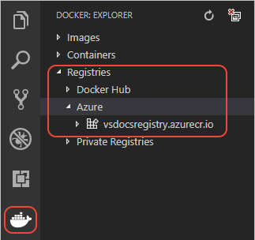
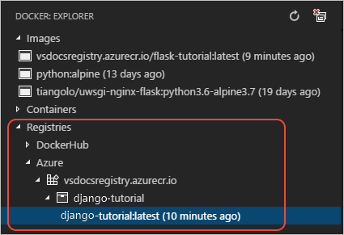

# Push Django images to a registry

## Create a container registry

Create a container registry to push images to. For more information about how to authenticate to and work with registries, see [Using container registries](quickstart-container-registries.md).

Make sure that the registry endpoint you created is visible under **Registries** in the **Docker Explorer** of VS Code:



## Settings for Django apps

1. In your Django project's `settings.py` file, modify the `ALLOWED_HOSTS` list to include the root URL to which you intend to deploy the app. For example, the following code assumes deployment to an Azure App Service (azurewebsites.net) named "vsdocs-django-sample-container":

    ```python
    ALLOWED_HOSTS = [
        # Example host name only; customize to your specific host
        "vsdocs-django-sample-container.azurewebsites.net"
    ]
    ```

    Without this entry, you'll see a "DisallowedHost" message after deployment that instructs to you add the website domain to `ALLOWED_HOSTS`. This will require you to rebuild, push, and redeploy the image once again.

1. On the **Command Palette** (`kb(workbench.action.showCommands)`), select **Docker: Build Image** to rebuild image with new settings.

    >**Tip**: If you want to test your image in production on multiple hosting services, you can simply input `"*"` in ALLOWED_HOSTS.

## Push the image to a registry

Once `ALLOWED_HOSTS` have been declared, the next step is to push your Django image to a container registry:

1. Open the **Command Palette** (`kb(workbench.action.showCommands)`) and select **Docker: Push**.

1. Choose the image you just built to push into the registry.

1. Choose the registry you created to push into. This will help with correctly tagging the image.

    

1. Once a registry and full tag have been chosen, the image will be pushed. Upload progress will appear in the **Terminal** window.

1. Once completed, expand the **Registries** > **Azure** (or **DockerHub**) node in the **Docker Explorer**, then expand the registry and image name to see the exact image. (You may need to refresh the **Docker Explorer**.)

    

  > **Tip**: The first time you push an image, you will see that VS Code uploads each layer the image is comprised of. Subsequent push operations, however, will only update layers starting from the first that has been changed. Since you app code is usually what changes most often, this is typically why app code is copied in the final lines of a Dockerfile. To see this inner loop in action, make a small change to your code, rebuild the image, and then push again to the registry.

Now that you've pushed your image to a registry, you're ready to deploy it to any container-ready cloud service. For details on deploying to Azure App Service, see [Deploy a container](https://docs.microsoft.com/azure/python/tutorial-deploy-containers-01).
